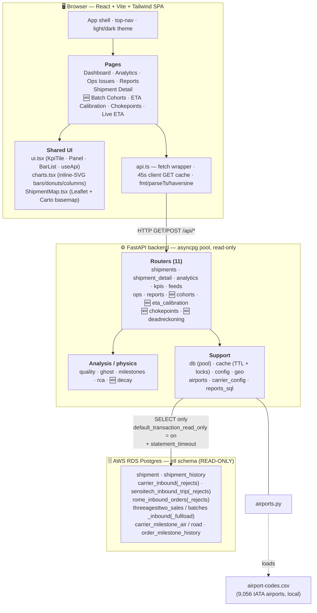
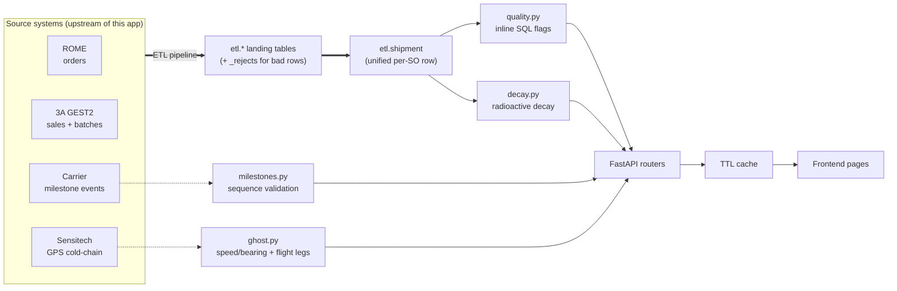
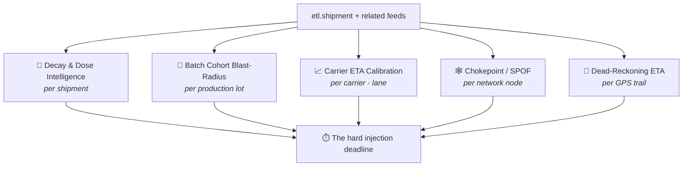

# RLT Shipment Monitoring — Architecture & Reference

Comprehensive reference for the RLT (Radioligand Therapy) Shipment Monitoring &
Ops-Observability platform: system architecture, data model, a module-by-module
breakdown of every section, and a deep-dive on the **Decision-Intelligence**
features that make this more than a dashboard.

> New here? Start with the [README](../README.md) for setup, then use this doc as
> the map. Sections marked **🆕 new** are the decision-intelligence layer added
> on top of the base observability app.

## Table of contents

1. [What this is (and why it's hard)](#1-what-this-is-and-why-its-hard)
2. [System architecture](#2-system-architecture)
3. [Data flow & request lifecycle](#3-data-flow--request-lifecycle)
4. [ETL data model](#4-etl-data-model)
5. [Backend — module map](#5-backend--module-map)
6. [Frontend — module map](#6-frontend--module-map)
7. [Decision Intelligence — what's new & innovative 🆕](#7-decision-intelligence--whats-new--innovative)
8. [Cross-cutting design principles](#8-cross-cutting-design-principles)

---

## 1. What this is (and why it's hard)

Novartis ships **radioligand therapies** — Pluvicto (Lu-177 PSMA-617) and
Lutathera (Lu-177 DOTATATE) — to hospitals worldwide. These are not ordinary
parcels:

- **The payload is radioactive and decaying.** Lutetium-177 has a half-life of
  **6.647 days**; the vial is calibrated so the *prescribed* activity lands at a
  **scheduled injection time**. Every hour of transit delay decays the dose, and
  a dose delivered too late is **clinically unusable** — it cannot be re-made in
  time and the patient's cycle slips.
- **The deadline is hard and per-patient.** Each shipment is one patient's dose
  with a fixed injection appointment. There is no "deliver tomorrow instead."
- **One production lot fans out to many patients.** A single decay-synchronised
  bulk batch is split into per-patient vials, so a batch problem is a
  *correlated, multi-patient* event, not an isolated parcel delay.

The platform ingests the ETL feeds behind these shipments and does two things:

1. **Observability** — surfaces the live state, traces missing data back to the
   source system that failed to deliver it, validates carrier milestone
   sequences, scans GPS trails for ghost pings, and root-causes overdue
   injections.
2. **Decision intelligence 🆕** — models the *physics and the network* of the
   dose flow: radioactive decay of the delivered dose, patient blast-radius per
   production lot, bias-corrected carrier ETAs, network single-points-of-failure,
   and an independent GPS-derived ETA with stall / wrong-way detection.

Everything is **strictly read-only** over the `etl` schema — no writes, no schema
changes — and every query is bounded and cached to keep DB load light.

---

## 2. System architecture

**Stack**

| Layer | Technology | Notes |
|---|---|---|
| Frontend | React 18 + Vite + Tailwind, React-Router, React-Leaflet | Hand-rolled inline-SVG charts (no chart lib); theme-aware design tokens |
| Backend | FastAPI + asyncpg | Async, connection-pooled, read-only transactions |
| Database | AWS RDS Postgres (`etl` schema) | Owned by the ETL pipeline; this app only reads it |
| Reference data | `airport-codes` dataset (~6 MB) | Downloaded once into `backend/data/`, loaded in-memory |
| Local dev DB | Postgres 16 in Docker + `backend/mockdb/init.sql` | Git-ignored; seeds every failure mode + the feature demos |

---

## 3. Data flow & request lifecycle

**A typical request** (`GET /api/cohorts`):

1. Frontend `useApi()` calls `api('/api/cohorts')`; `api.ts` short-circuits to its
   45-second client cache if the same URL was fetched recently.
2. The request hits the FastAPI router. The router wraps its work in
   `cached(key, ttl, fn)` — an **in-process TTL cache with per-key locks**, so N
   open dashboards cost the DB one query burst per TTL, not N.
3. On a cache miss, the router runs a **bounded** SQL query (windowed +
   `LIMIT`) through the read-only asyncpg pool, then aggregates in Python.
4. The JSON response flows back; the page renders it with shared components.

Per-shipment endpoints (`/detail`, `/pings`, `/dose`, …) are always fresh (no
server cache); aggregate/fleet endpoints are cached (60 s – 5 min).

---

## 4. ETL data model

All tables live in the `etl` schema. The app **reads** them; the ETL pipeline
owns and writes them. `_rejects` siblings hold rows that failed ingestion (with
an `error_message`); `_fullload` siblings are periodic full snapshots whose
ingest time is a **text** `load_timestamp` (everything else uses
`audit_timestamp`).

| Source | Tables | What it carries |
|---|---|---|
| **Unified** | `shipment` | The denormalised per-sales-order row the whole app centres on: tracking #, product, carrier, origin/destination + coords, region, injection date/time, planned/actual delivery, ETA, milestone, risk, dose status, alerts, mode of transport, vial expiry, POD, GPS summary. |
| **History** | `shipment_history` | Point-in-time snapshots (ETA revisions, risk changes) — the derivative signal behind future ETA-drift work. |
| **ROME** | `rome_inbound_orders`, `rome_inbound_rejects` | The order system: planned delivery, physician, cancellation. |
| **3A GEST2** | `threeagesttwo_sales_inbound(_fullload)`, `threeagesttwo_batches_inbound(_fullload)` | Sales orders and **batches** — batch number, status, and (where present) the dose activity columns (`mbq`/`gbq`/`mci`/`planned_activity`/`tinj_datetime`/`texp`) plus patient/vial fan-out fields. |
| **Carrier** | `carrier_inbound`, `carrier_inbound_rejects` | Raw milestone events, flight number, departure/arrival airport IATA, flight details. |
| **Sensitech** | `sensitech_inbound_trip`, `sensitech_inbound_rejects` | GPS cold-chain pings: lat/lon, device time, address, device serial. |
| **Reference maps** | `carrier_milestone_air`, `carrier_milestone_road`, `order_milestone_history` | Per-carrier expected milestone ladders (air vs road) + multi-leg custody history. |

> **Schema is treated as unknown.** The dose-activity, patient/vial, and
> `shipment_history` columns **may not exist** on a given real deployment, so the
> features that use them probe `information_schema` first and degrade gracefully.

---

## 5. Backend — module map

`backend/app/` — FastAPI application.

### Routers (`app/routers/`)

| File | Endpoints | Responsibility |
|---|---|---|
| `shipments.py` | `GET /api/shipments`, `/filters` | Paginated, filtered shipment list with inline flag booleans; 15-day injection window default. |
| `shipment_detail.py` | `GET /api/shipments/{tn}/detail · /pings · /milestones · /lifecycle · 🆕 /dose` | Single-shipment view: full row + issues + source traces + RCA; GPS pings merged across all SOs on a tracking number; per-SO milestone validation; data-provenance timeline; **🆕 dose decay model.** |
| `analytics.py` | `GET /api/analytics/carriers · /overview · /dwell` | Fleet & carrier performance, status/mode/region/product distributions, top lanes, weekly trend, milestone dwell time. |
| `kpis.py` | `GET /api/kpis · /kpis/injections · /kpis/alerts` | One-pass KPI aggregates + flag/reject counts; injection outlook (today/tomorrow/future); alert-title breakdown. |
| `feeds.py` | `GET /api/feeds/health` | Per-inbound-table silence & volume-anomaly monitor. |
| `ops.py` | `GET /api/ops/injection-risk · /data-quality · /sequence-violations · /stale-injections · /rejects` | The "flag problems" surface: RLT deadline board, data-quality drill-downs, milestone-sequence violations, overdue-injection RCA, reject feeds. |
| `reports.py` | `POST /api/reports/carrier-issues · /carrier-issues/email` | On-demand carrier data-quality report + editable carrier-email draft (.eml). |
| 🆕 `cohorts.py` | `GET /api/cohorts` | **Batch Cohort Blast-Radius** — patients at risk per production lot. |
| 🆕 `eta_calibration.py` | `GET /api/eta-calibration` | **Carrier ETA Calibration** — bias-corrected delivery forecast. |
| 🆕 `chokepoints.py` | `GET /api/chokepoints` | **Chokepoint / SPOF board** — network single-points-of-failure. |
| 🆕 `deadreckoning.py` | `GET /api/dead-reckoning` | **Dead-Reckoning ETA & Stall** — independent GPS-derived ETA. |

### Analysis & physics (`app/analysis/`, `app/decay.py`)

| File | Responsibility |
|---|---|
| `quality.py` | The data-quality flag catalogue — each flag is a **SQL boolean expression** evaluated inline (single pass, no joins). Also the shared `ACTIVE_SQL` / `DELIVERED_SQL` / `CANCELLED_SQL` terminal-state heuristics and `IS_AIR_SQL` (mode-based, not flight-number-based). |
| `ghost.py` | Ghost-ping detection from consecutive-ping speed + bearing (`teleport`, `short_hop`, `bounce`, `invalid_coords`, `time_conflict`) and inferred flight-leg extraction. |
| `milestones.py` | Loads the per-carrier air/road milestone maps, infers a shipment's mode, and replays carrier events in event-time order to flag sequence violations. |
| `rca.py` | Root-cause verdicts for overdue injections and per-field "where is the missing data?" source tracing. |
| 🆕 `decay.py` | Deterministic radioactive-decay physics: `A(t) = A₀·2^(−(t−t₀)/t½)`, half-life table (Lu-177 = 159.53 h + others), isotope resolution from product name, activity-unit conversions (GBq/MBq/mCi), usable-window math, and curve sampling. |

### Support (`app/`)

| File | Responsibility |
|---|---|
| `db.py` | asyncpg connection pool; every session opened `default_transaction_read_only=on` + `statement_timeout`. `fetch_all/one/val` helpers. |
| `cache.py` | In-process TTL cache with **per-key locks** (one DB burst per TTL regardless of concurrent dashboards). |
| `config.py` | Env-driven settings (`DB_*`, `ACTIVE_WINDOW_DAYS`, `GPS_STALE_HOURS`, `GHOST_MAX_SPEED_KMH`, `DEFAULT_GEOFENCE_KM`). |
| `geo.py` | `haversine_km`, `initial_bearing_deg`, `bearing_delta_deg`, coordinate parsing/validation. |
| `airports.py` | Loads the IATA airport dataset (9,056 airports) and finds the nearest airport to a coordinate. |
| `carrier_config.py` | Per-carrier delivery/cancellation event vocabulary + the ~40 report flag definitions. |
| `reports_sql.py` | The large carrier-issue report SQL (bounded `latest_orders` + carrier prune + single-scan carrier events). |
| `main.py` | App factory, CORS, router registration, `/api/health`. |

---

## 6. Frontend — module map

`frontend/src/` — React + Vite SPA.

### Pages (`src/pages/`)

| Page | Route | What it shows |
|---|---|---|
| `DashboardPage` | `/` | Fleet KPIs, flag volumes, the filtered shipment table. |
| `AnalyticsPage` | `/analytics` | Carrier performance, distributions, lanes, weekly trend, dwell time — all inline-SVG charts. |
| `OpsPage` | `/ops` | Tabbed "flag problems": injection-risk, data-quality, milestone-sequence, overdue RCA, feed rejects. |
| `ReportsPage` | `/reports` | On-demand carrier-issue report + carrier-email composer. |
| `ShipmentDetailPage` | `/shipment/:tn` | The revamped single-shipment view (header · KPI strip · milestone stepper · **🆕 decay & dose panel** · order-details card · map + GPS analytics · milestones · lifecycle · RCA). |
| 🆕 `BatchCohortsPage` | `/cohorts` | Production lots ranked by patient blast-radius. |
| 🆕 `ETACalibrationPage` | `/eta-calibration` | Carrier bias leaderboard + bias-corrected live forecast. |
| 🆕 `ChokepointsPage` | `/chokepoints` | Top network single-points-of-failure + per-layer concentration. |
| 🆕 `DeadReckoningPage` | `/dead-reckoning` ("Live ETA") | Independent GPS ETA / stall / wrong-way board. |

### Shared components (`src/components/`, `src/api.ts`)

| File | Provides |
|---|---|
| `ui.tsx` | `KpiTile`, `Panel`, `BarList`, `SeverityBadge`, `IssueChips`, `Spinner`, `ErrorBox`, and the `useApi` data hook (stale-while-revalidate). Severity colour/icon tokens. |
| `charts.tsx` | Hand-rolled, theme-aware inline-SVG charts: `HBarChart`, `Donut`, `StackedColumns` — no chart-library dependency. |
| `ShipmentMap.tsx` | Leaflet map (Carto basemap) with layer toggles, distinct markers (aircraft / airport / truck / pin), and the animated in-flight aircraft. |
| `api.ts` | `fetch` wrapper with a 45-second client GET cache; `fmt` (dates/nums/durations, UTC-normalised), `parseTs`, `haversineKm`. |

---

## 7. Decision Intelligence — what's new & innovative

The base app answers *"what's the state, and what's broken?"* These five features
answer *"what does the **physics and the network** say will happen, and who does
it hurt?"* — each is **read-only, bounded, deterministic (no ML)**, and built
entirely on data that already exists.

### 7.1 🧪 Decay & Dose Intelligence  · shipment detail page · `/api/shipments/{tn}/dose`

**Answers:** *Will the dose still be clinically usable when it arrives — and how
much activity margin is left?*

- **Why it's new:** the app tracked *where* a parcel is, never *how radioactive*
  it still is. This is the only view that models the actual payload.
- **How it works:** the vial is calibrated to the prescribed activity at the
  scheduled injection time; activity then follows `A(t) = A₀·2^(−(t−t₀)/t½)` with
  Lu-177's 6.647-day half-life. A **live activity gauge** shows current % of
  prescribed against the usable ±10% band; a **decay curve** plots activity over
  time with the injection / now / ETA / usable-window-close markers. Verdict:
  `pre_window` (hotter than prescribed) → `in_window` → `will_underdose` →
  `underdosed`.
- **Data used:** `threeagesttwo_batches_inbound` activity columns (`mbq`/`gbq`/
  `mci`/`planned_activity`/`planned_mbq`/`tinj_datetime`/`texp`) + shipment
  injection time & ETA. **Schema-adaptive:** probes `information_schema`,
  NULL-aliases absent columns, and degrades to `has_dose:false` instead of
  erroring where the activity columns don't exist.

### 7.2 🎯 Batch Cohort Blast-Radius  · `/cohorts` · `/api/cohorts`

**Answers:** *If one production lot is delayed or held, how many un-injected
patients does it strand at once?*

- **Why it's new:** every other view is shipment-centric. RLT's true failure
  unit is the **decay-synchronised batch** fanned out to many patients — a
  correlated cohort miss that N independent parcel alerts hide. Reframes "N
  shipment alerts" as **"M patients at risk from lot X."**
- **How it works:** groups injection-windowed shipments by `batchnumber`,
  classifies each dose (`delivered` / `overdue` / `imminent ≤48h` / `upcoming`),
  and ranks lots by blast-radius (undelivered doses). Optional batch-status /
  distinct-patient enrichment from the batch table (schema-adaptive).
- **Data used:** `etl.shipment` (batchnumber, injection date, dose status, risk)
  + `threeagesttwo_batches_inbound` (batch status, patient/vial fan-out where
  present).

### 7.3 📈 Carrier ETA Calibration  · `/eta-calibration` · `/api/eta-calibration`

**Answers:** *Given this carrier's own track record, will the dose **actually**
arrive in time — even though its ETA says "on-track"?*

- **Why it's new:** carrier analytics report an aggregate on-time %, but nobody
  uses history to **correct an individual live ETA**. A chronically-optimistic
  carrier quietly turns on-track doses into missed injections.
- **How it works:** a **backward pass** over delivered history learns each
  carrier's median delivery bias + MAD spread (precise-hours when a real
  committed time exists, else day-level slippage so an unknown planned
  time-of-day can't fake a bias). A **forward pass** adds that bias to live
  ETAs and re-checks the injection deadline & vial expiry — surfacing **FLIPPED**
  doses (looked on-track by the raw ETA, will miss once corrected). A min-sample
  guard stops thin lanes from producing noisy bias.
- **Data used:** `etl.shipment` (carrier, mode, planned/actual delivery, ETA,
  injection deadline, vial expiry); `shipment_history` optionally sharpens the
  "earliest committed ETA" but is never required.

### 7.4 🕸️ Chokepoint / Single-Point-of-Failure  · `/chokepoints` · `/api/chokepoints`

**Answers:** *Which single node — dispatch origin, carrier, airport hub, or
region — would strand the most doses if it went dark?*

- **Why it's new:** existing analytics list carriers/lanes as flat, independent
  counts. This models the live dose flow as a **connected topology** and asks the
  "what fails if this fails" question. For un-reproducible JIT doses, *concentration
  is systemic risk*.
- **How it works:** decomposes each active dose into four node layers
  (origin → carrier → hub → region), counts doses through each node, and ranks
  nodes by blast-radius. Adds a **Herfindahl concentration index** per layer
  (Diversified → Moderate → High → Extreme) and a sole-path flag, so a lane with
  no fallback stands out.
- **Data used:** `etl.shipment` (origin, carrier, region, injection date) +
  `carrier_inbound` departure/arrival airport IATA (set-based hub lookup).

### 7.5 📡 Dead-Reckoning ETA & Stall  · `/dead-reckoning` ("Live ETA") · `/api/dead-reckoning`

**Answers:** *Forget the carrier's promise — what does the raw GPS trail say, and
is the dose actually progressing toward the patient?*

- **Why it's new:** the injection-risk board trusts the carrier ETA verbatim.
  This is the first **independent** ETA, and its **closing-speed** signal catches
  two failure modes ghost detection can't: *moving-but-not-toward-the-patient* and
  *stalled-but-still-pinging.*
- **How it works:** from the Sensitech ping trail it computes **closing speed**
  (the rate the straight-line distance to destination is shrinking), remaining
  distance, route %, and a stall clock. GPS ETA = remaining ÷ recent closing
  speed. Verdicts: `stalled` · `moving_wrong_way` · `will_miss_gps` ·
  `gps_stale` · `on_track`. The recent window is time-bounded so a genuine stall
  reads as ~zero closing rather than being averaged out by an earlier moving leg.
- **Data used:** `sensitech_inbound_trip` (lat/lon, device time) + `etl.shipment`
  (destination coords, distance, ETA, injection deadline, vial expiry). Reuses
  `geo.haversine_km`.

---

## 8. Cross-cutting design principles

These hold across every endpoint — old and new.

| Principle | How it's enforced |
|---|---|
| **Strictly read-only** | asyncpg pool opens every session `default_transaction_read_only=on`; the app issues only `SELECT`s. No writes, no DDL, no schema changes anywhere. |
| **Bounded & cheap** | Every query is windowed (injection date / recency) and `LIMIT`-bounded; set-based `= ANY($1::text[])` batches instead of N+1 correlated subqueries (a past source of `statement_timeout`s). Aggregation happens in Python over a small windowed set. |
| **Schema-adaptive** | Features that touch optional columns (dose activity, patient/vial, `shipment_history`) probe `information_schema` and NULL-alias / skip what's absent, degrading gracefully instead of 500-ing on an unknown real schema. |
| **Deterministic, no ML** | Every "intelligence" output is explainable physics or arithmetic (decay curve, median bias, Herfindahl index, closing speed) — auditable and reproducible, which matters for a clinical supply chain. |
| **One consistent time base** | DB `timestamptz` normalises to naive-UTC; server "now" uses `datetime.utcnow()`; API timestamps are emitted with an explicit `Z` so the frontend's local-time formatter and its UTC chart-marker parser agree. |
| **Cache once, serve many** | In-process TTL cache with per-key locks on the server + a 45-second client GET cache, so many open dashboards cost the DB one query burst per TTL. |
| **Postgres-safe casts** | Blank checks and regex guards cast `::text` first (regex on a real `date`/`timestamp` column errors); date logic is guarded by a `~ '^\s*\d{4}-\d{2}-\d{2}'` CASE before `::date`. |

---

*Generated as living documentation — keep it in step with the routers and pages
it describes.*
